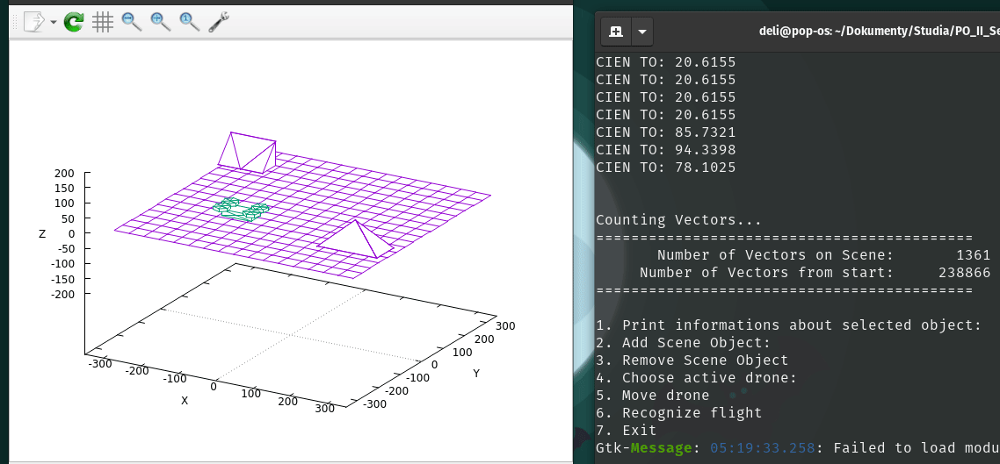

# Zadanie 5 Dron na Tytanie Faza 2
## Wykonane zadania
- Stworzenie 3 przeszkód
- Możliwość tworzenia obiektów
- Możliwość usuwania obiektów
- Losowe położenie 



## Budowanie

``` bash
git clone https://github.com/KPO-2020-2021/zad5_2-delipl.git # Cloning repository
cd zad5_2-delipl

mkdir lib/  # Download doctest lib
cd lib
git submodule add https://github.com/onqtam/doctest.git
git submodule add https://github.com/jothepro/doxygen-awesome-css.git
cd ../

mkdir build tmp && cd build
cmake ..           # options: -DCMAKE_BUILD_TYPE=[Debug | Coverage | Release], Debug is default
make fulltest      # Makes and runs the tests.
make doc

make app           # build and run
```

## Dokumentacja
Dokumentacja po zbudowaniu znajduje się w build/html/index.html

``` bash
firefox html/index.html
```